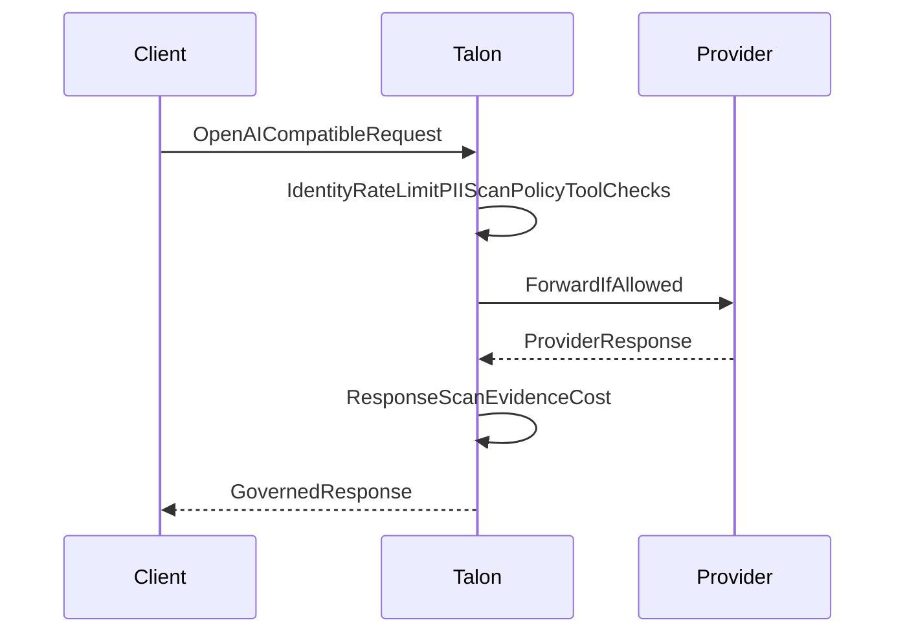

# Dativo Talon

**The control plane for your company's AI use cases.**

[](https://github.com/dativo-io/talon/actions/workflows/ci.yml)
[](https://github.com/dativo-io/talon/actions/workflows/codeql.yml)
[](https://github.com/dativo-io/talon/releases/latest)
[](https://goreportcard.com/report/github.com/dativo-io/talon)
[](LICENSE)

Every AI use case a company ships — a customer-support assistant, a coding assistant, a document summarizer — reinvents the same operational plumbing: its own cost controls, its own retry behavior, its own data policy, its own incident trail. The result is use cases you can't reliably operate, and agentic projects that stall because nobody can control them. Talon is one self-hosted Go binary in front of OpenAI, Anthropic, AWS Bedrock, Azure OpenAI, local Ollama, and any OpenAI-compatible endpoint: point every use case at it and each one gets budget caps enforced **before** the provider is called, policy-checked failover when a provider degrades, central policy defaults with explicit exceptions for PII, tools, and data destinations, and a per-use-case view of what each did and spent — with a signed, verifiable evidence record behind every decision. Operate the whole fleet — discover, inspect, stop, and reconfigure every use case — from one gateway. Apache 2.0.

[](examples/product-demo/)

*One operating layer for a company's AI use cases — **customer-support, coding-assistant, document-summary** — through one gateway: a downed local model triggers a **policy-valid failover** (skipping a provider this use case may not use), customer **PII is redacted before the provider**, a destructive **admin tool is rejected by a company-wide boundary**, a use case's **next call is denied on projected cost before it spends**, and one **fleet view** shows what each did — every decision signed and offline-verifiable.*

<!-- Static, motion-free version of the demo above — the same four things Talon does for every use case, in one operating period: -->

```
customer-support   reliability     local model down → skips a provider it may not use → policy-valid failover
                   shared policy   customer email + IBAN → redacted before the provider ([EMAIL], [IBAN])
coding-assistant   shared policy   admin_* tool → rejected by the company boundary, before the model
document-summary   cost control    projected cost over budget → next call denied before the provider
the fleet          understanding   talon agents → STATE / HEALTH / COST / WHY; every decision signed & verified
```

**Operate three use cases →** [Product demo](examples/product-demo/) (real providers, ~$0.05) · **See it in 60 seconds, no key →** [Quickstart](#try-it-in-60-seconds-no-api-key) · **Deep proof, one session →** [Governed session demo](#governed-session-demo-real-providers) · **Pilot a real use case →** [Open a pilot issue](https://github.com/dativo-io/talon/issues/new?title=Pilot%3A%20%3Cyour%20stack%3E&body=Current%20stack%3A%0AFirst%20control%20I%20need%20%28PII%20%2F%20spend%20%2F%20tools%20%2F%20data%20residency%29%3A)

---

## Is this you?

Talon is for teams that **already have AI use cases in production** — or blocked on the way there — and need to answer:

- **How much is each use case spending, and how do we stop runaway spend?** (a cap that denies the request before the provider is called, not an alert after the bill)
- **What happens when a provider times out or rate-limits?** (one central failure behavior — policy-checked fallback — instead of N ad-hoc retry loops)
- **Which models, tools, and data destinations are actually allowed?** (central defaults with explicit exceptions, enforced before the model runs, not "should be")
- **What did that agent actually do — and can we prove it later?** (per-session visibility, backed by a signed record an auditor can verify offline)

If those are your questions, Talon sits in front of your existing OpenAI/Anthropic traffic and answers them at the boundary — no SDK change, same response shape.

---

## One control plane, four jobs

### 1. Cost control — stop spend before it happens

- Per-agent daily/monthly caps: the request is denied *before* the provider call, not flagged after the money is gone.
- Session budgets across providers (soft cap — see [limitations](LIMITATIONS.md)), plus cache-aware, currency-labeled cost attribution by tenant/agent from an editable pricing table.

→ [Cap AI spend per agent](docs/guides/cost-governance-by-agent.md)

### 2. Reliability — one failure behavior, not N

- Error-driven provider fallback chains on timeouts, connection errors, 429s and 5xx — and every fallback candidate is re-checked against sovereignty, model, and budget policy before it is tried.
- Fail-closed on exhaustion: a policy denial or budget stop is never "retried around" to keep traffic up.

→ [Provider fallback chains](docs/reference/configuration.md#provider-fallback-chains-error-driven-failover)

### 3. Shared policy — central defaults, explicit exceptions

- PII scanning (regex, Presidio, HTTP, or local-LLM engines) on prompts, attachments, tool arguments, and responses; redact, block, or warn before the provider — EU identifiers (IBAN MOD-97, VAT, national IDs) plus email, phone, card, passport, IP.
- Tool allowlists and forbidden globs (`admin_*`): dangerous tools are stripped or blocked before the model ever sees them; MCP tool calls routed through Talon are policy-checked before execution.
- Egress and sovereignty rules: `eu_strict` / `eu_preferred` / `global` routing and destination controls, air-gap friendly.

→ [Policy cookbook](docs/guides/policy-cookbook.md)

### 4. Session understanding — know what every use case did

- Session identity from `X-Talon-Session-ID`, vendor headers (Claude Code, Codex CLI), or a synthetic evidence-only ID — attribution boundaries kept honest.
- Session-scoped audit and cost rollups (`talon audit list --session`, `talon audit verify --session`); live metrics API, SSE stream, OpenTelemetry GenAI traces, embedded dashboards.

→ [Governing coding agents](docs/guides/governing-coding-agents.md)

### Underneath all four: verifiable evidence

Every decision — allow, deny, redact, fallback, budget stop — becomes an HMAC-SHA256-signed, tamper-evident record you can list, verify (including offline), and export to CSV/JSON/signed-JSON. This is the proof layer the pillars stand on, and what compliance reports (GDPR Art. 30 RoPA, EU AI Act Annex IV) are generated from — supporting evidence, not a compliance determination.

→ [Evidence store](docs/explanation/evidence-store.md) · [What Talon is (and is not)](docs/explanation/control-plane.md) · [Limitations](LIMITATIONS.md)

---

## Start with one AI use case

You don't have to trust Talon in blocking mode on day one.

1. **Put Talon in front of one** dev or internal use case (change the base URL, present its agent key).
2. **Start in shadow mode** — Talon records what policy *would* do (PII, tools, spend, destinations) **without changing the response**.
3. **Turn on one control** when you're ready: block PII, cap spend, keep confidential data local, or strip a dangerous tool.

**Which are you?**

| I have… | Start here |
|---------|-----------|
| An existing OpenAI/Anthropic app | [Change the base URL](#drop-in-openai-proxy) |
| OpenClaw or a coding agent | [Use the integration pack](#integration-paths) |
| A new agent to build | `talon init` → `talon run` ([guide](docs/tutorials/first-governed-agent.md)) |

Or just [try it with no key](#try-it-in-60-seconds-no-api-key) first, then [open a pilot issue](https://github.com/dativo-io/talon/issues/new?title=Pilot%3A%20%3Cyour%20stack%3E&body=Current%20stack%3A%0AFirst%20control%20I%20need%20%28PII%20%2F%20spend%20%2F%20tools%20%2F%20data%20residency%29%3A) with your stack and the first control you need.

---

## Product demo — three use cases, one control plane

The canonical demo operates **customer-support, coding-assistant, and document-summary** as three `agent.talon.yaml` files under one `agents_dir`, on real providers, and walks the four pillars in one operating period:

```bash
export OPENAI_API_KEY=sk-...  ANTHROPIC_API_KEY=sk-ant-...   # stop Ollama first
make product-demo
```

You watch, in one gateway: a downed local model trigger a **policy-valid failover** that *skips* a provider this use case isn't allowed to use; an email + IBAN **redacted before the provider**; a destructive `admin_*` tool **rejected by a company-wide boundary** the agent can't weaken; a use case's next call **denied on projected cost before it spends**; the `talon agents` fleet view flag the exhausted use case as `blocked`; and a **signed export verified offline**. Every receipt is parsed from Talon's own signed evidence. Real providers, ≈ $0.02–0.05/run (denials cost $0), no Docker. Full walk-through: [examples/product-demo](examples/product-demo/README.md).

---

## Try it in 60 seconds (no API key)

The bundled Docker Compose stack runs Talon plus a mock provider, so the full pipeline (policy, PII, cost, evidence) runs without any real LLM key.

```bash
git clone https://github.com/dativo-io/talon && cd talon
cd examples/docker-compose && docker compose up
```

In another terminal, send a request containing an email and an IBAN:

```bash
curl -X POST http://localhost:8080/v1/proxy/openai/v1/chat/completions \
  -H "Content-Type: application/json" \
  -d '{"model":"gpt-4o-mini","messages":[{"role":"user","content":"My email is jan@example.com and my IBAN is DE89370400440532013000. Help me reset my password."}]}'
```

You get a standard OpenAI-compatible JSON response — and Talon still ran every governance check. Inspect the signed evidence:

```bash
docker compose exec talon /usr/local/bin/talon audit list
docker compose exec talon /usr/local/bin/talon audit show <evidence-id>
```

The record shows the PII detected (email, IBAN), the data tier, the policy decision, the cost, and a verifiable HMAC signature.

> **Why did the IBAN go through?** This demo ships in **shadow mode**: Talon *records* what policy would do — including the PII it found — **without changing the request**. That's the low-risk way to adopt: drop Talon in front of real traffic, see what it flags for a week, then flip to **enforce mode** to redact or block the IBAN before the provider (exactly what the hero above shows). One config line: `mode: shadow` → `mode: enforce`.

Full walk-through: [60-second demo](docs/tutorials/quickstart-demo.md).

---

## Drop-in OpenAI proxy

For an existing OpenAI SDK app, start the dev quickstart proxy and repoint the base URL — same request shape, same SDK, governed path:

```bash
talon serve --proxy-quickstart --port 8080
export OPENAI_BASE_URL=http://127.0.0.1:8080/v1
export OPENAI_API_KEY=sk-...
```

```python
import openai

client = openai.OpenAI(base_url="http://127.0.0.1:8080/v1", api_key="sk-...")
resp = client.chat.completions.create(
    model="gpt-4o-mini",
    messages=[{"role": "user", "content": "Summarize EU AI Act obligations for SMBs."}],
)
print(resp.choices[0].message.content)
```

Governance (policy, PII scan/redaction, evidence) stays active in quickstart mode. For production, use `--gateway` with `talon.config.yaml`. See [OpenAI proxy quickstart](docs/tutorials/proxy-quickstart.md).

---

## Governed session demo (real providers)

Watch one AI use case operate under a cross-provider session budget, central policy, and per-session visibility — a **real** agent session with an Anthropic planner and OpenAI executors through the same gateway, bring-your-own keys (≈ $0.03/run, cheap models, session-capped):

```bash
export ANTHROPIC_API_KEY=sk-ant-... OPENAI_API_KEY=sk-...
make governed-session
cd examples/governed-session && ./demo.sh all
```


```
session begins ──▶ Anthropic orchestrates (prompt-cache write, then read); ChatGPT executes the plan
               ──▶ forbidden admin_* tool stripped · email redacted · model-allowlist deny
               ──▶ IBAN probe denied before any provider call
               ──▶ confidential data → US model rejected by policy → local Llama runs it (routed)
               ──▶ real cross-provider spend reaches the session cap → 403 session_budget_exceeded
               ──▶ money story from the signed export; flipping a signed field makes audit verify report INVALID
               ──▶ talon audit verify --session → N valid, 0 invalid; talon compliance ropa → GDPR Art. 30 pack
```

The sovereignty act shows **data classification driving execution placement**: confidential input is refused by the US model and runs locally instead — the same IBAN the gateway blocks outright elsewhere, because policy (not the data alone) decides the outcome. Every decision is a signed evidence record in one session trail: supporting controls and evidence for GDPR and EU AI Act reviews, not a compliance guarantee.

Recorded with [asciinema](https://asciinema.org) ([cast](docs/assets/talon_demo.cast) · [`scripts/record-governed-session.sh`](scripts/record-governed-session.sh)). Full walk-through: [governed-session demo](examples/governed-session/README.md). The sovereignty-routing act needs a local Ollama (opt-in `routing-demo` compose profile).

---

## What Talon does to every request

Each request flows through one governed pipeline before (and after) it reaches a provider:



Resolve agent → rate limit → parse model/text/tools → **PII scan** → classify data tier → **OPA policy decision** (allowlist, cost, tier, provider) → **tool governance** → redact/block → forward with the vault key → response scan → **signed evidence + cost**. Pipeline overhead is typically under 15ms excluding upstream latency (`make benchmarks`).

Full byte-level breakdown: [What Talon does to your request](docs/explanation/what-talon-does-to-your-request.md) · [Benchmarks](docs/reference/benchmarks.md).

---

## Capabilities by pillar

| Pillar | What you get | Details |
|--------|--------------|---------|
| **Cost control** | Per-agent daily/monthly caps evaluated before the call; session budgets (soft); cache-aware, currency-labeled per-request estimation from an editable pricing table; attribution by tenant/agent. | [Cap AI spend per agent](docs/guides/cost-governance-by-agent.md) |
| **Reliability** | Error-driven, policy-valid provider fallback chains; connect/response-header timeout controls; provider-native error shapes; OTel GenAI traces. | [Fallback chains](docs/reference/configuration.md#provider-fallback-chains-error-driven-failover) · [Observability](docs/OBSERVABILITY.md) |
| **Shared policy** | Presidio-compatible input/output PII scanning (EU identifiers + email, phone, card, passport, IP) with redact/block/warn; tool allowlists/forbidden globs filtered before the model; egress and sovereignty rules. | [Policy cookbook](docs/guides/policy-cookbook.md) |
| **Session understanding** | Session identity (explicit/vendor/synthetic), session-scoped audit + cost rollups, dashboard session drill-down, metrics API + SSE stream. | [Governing coding agents](docs/guides/governing-coding-agents.md) · [Gateway dashboard](docs/reference/gateway-dashboard.md) |
| **Proof layer (cross-cutting)** | HMAC-SHA256 signed record per request; verify online/offline; export to CSV/JSON/signed-JSON; compliance report generators (GDPR Art. 30 RoPA, EU AI Act Annex IV) built on the evidence. | [Evidence store](docs/explanation/evidence-store.md) · [Conformance](docs/reference/conformance.md) |
| **Differentiators** | Single self-hosted binary; provider registry with jurisdiction + EU-region metadata; `eu_strict` / `eu_preferred` / `global` routing enforced by OPA; air-gap deployment mode. | [Provider registry](docs/reference/provider-registry.md) · [Air-gapped deployment](docs/guides/air-gapped-deployment.md) |

**317 passing conformance tests** across the evidence + policy paths — reproduce with `make conformance`.

---

## Supported providers

Talon proxies **OpenAI**, **Anthropic**, **AWS Bedrock**, **Azure OpenAI**, **local Ollama**, plus **Mistral**, **Vertex**, **Cohere**, **Qwen**, and any `generic-openai`-compatible endpoint. Every provider carries jurisdiction and region metadata that routing policy can act on — EU-capable options include Azure OpenAI (westeurope, swedencentral, francecentral, uksouth), AWS Bedrock (eu-central-1, eu-west-1, eu-west-3), Mistral (EU), Vertex (europe-west1/4/9), and local Ollama.

Full table with regions and notes: [Provider registry](docs/reference/provider-registry.md). Inspect live: `talon provider list`, `talon provider info <type>`, `talon provider allowed`.

---

## Integration paths

| Path | When | How |
|------|------|-----|
| Existing app | You already call OpenAI/Anthropic | Change the base URL and present the use case's agent key. See [Add Talon to your existing app](docs/guides/add-talon-to-existing-app.md). |
| Slack bot | A bot calls an LLM SDK | Route the OpenAI SDK through Talon. See [Slack bot integration](docs/guides/slack-bot-integration.md). |
| OpenClaw | You run OpenClaw | Point its provider base URL at the gateway. See [OpenClaw integration](docs/guides/openclaw-integration.md). |
| Coding agents | You run Claude Code or Codex CLI | `talon init --pack coding-agents`, point the tool's base URL at the gateway. See [Claude Code](docs/guides/claude-code-integration.md), [Codex CLI](docs/guides/codex-cli-integration.md), [Governing coding agents](docs/guides/governing-coding-agents.md). |
| MCP / vendor proxy | Third-party AI vendors | Route MCP traffic through Talon for tool governance and evidence. See [Vendor integration guide](docs/VENDOR_INTEGRATION_GUIDE.md). |
| Native Talon agent | Greenfield agent | Run governed agents directly with `talon run`. See [Your first governed agent](docs/tutorials/first-governed-agent.md). |

---

## Where Talon fits

Routers optimize a single call; observability tools tell you what already happened. Talon operates the **AI use cases routed through it**: budget caps and policy decided *before* the request reaches the model, policy-valid fallback when providers fail, and a per-session trail of what each use case did — with every decision leaving a verifiable, signed record. One layer instead of per-app plumbing.

What "control plane" means here — and what Talon deliberately is not: [Talon as a control plane](docs/explanation/control-plane.md). Why a PII-redaction proxy isn't enough: [Why not a PII proxy](docs/explanation/why-not-a-pii-proxy.md).

---

## Built for teams that must prove it

Operating AI is the job; proving it is often the trigger. Talon is a single self-hosted binary (on-prem, EU cloud, or air-gapped — no required SaaS), with `eu_strict` routing to keep confidential data in-region or on local models, and signed evidence behind every decision. From that evidence, Talon generates supporting documentation for reviews: GDPR Art. 30 RoPA and EU AI Act Annex IV packs — **supporting controls and evidence, not a compliance determination**.

→ [Policy packs](docs/guides/policy-packs.md) · [Turnkey compliance reports](docs/tutorials/turnkey-compliance-reports.md) · [Air-gapped deployment](docs/guides/air-gapped-deployment.md) · [Provider registry](docs/reference/provider-registry.md)

---

## Install

Talon requires **CGO** (SQLite). Go **1.22+** recommended (CI uses 1.25.x).

```bash
# From source (recommended on macOS)
git clone https://github.com/dativo-io/talon && cd talon && make install

# Or go install
go install github.com/dativo-io/talon/cmd/talon@latest

# Or Docker
docker pull ghcr.io/dativo-io/talon:latest
```

Release tarballs (linux/amd64) and an install script are on [Releases](https://github.com/dativo-io/talon/releases/latest). Platform matrix, checksums, and the macOS `!tapi-tbd` workaround: [Quickstart install guide](docs/QUICKSTART.md).

**First run:**

```bash
export TALON_SECRETS_KEY="$(openssl rand -hex 32)"   # vault encryption key
talon init --scaffold --name my-agent                # agent.talon.yaml + talon.config.yaml
talon run --dry-run "hello"                          # no LLM API key required
```

---

## Configuration

Short examples below; full schemas in the [Policy cookbook](docs/guides/policy-cookbook.md) and [Configuration reference](docs/reference/configuration.md).

```yaml
# agent.talon.yaml — block on PII, cap spend
policies:
  data_classification: { input_scan: true, block_on_pii: true }
  cost_limits: { daily: 10.00, monthly: 200.00 }
```

```yaml
# talon.config.yaml — forbid dangerous tools, enforce EU-strict routing
gateway:
  default_policy:
    forbidden_tools: ["delete_*", "admin_*", "bulk_*"]
llm:
  routing:
    data_sovereignty_mode: eu_strict
```

```yaml
# talon.config.yaml — fallback on transient failures, cap a session's spend
gateway:
  providers:
    openai:
      base_url: "https://api.openai.com"
      secret_name: "openai-api-key"
      fallback:
        - provider: "mistral-eu"        # tried in order on timeout/429/5xx — policy-checked first
```

```yaml
# agent.talon.yaml — one file per AI use case; its vault-bound key is the traffic identity
agent:
  name: support-bot
  key:
    secret_name: "support-bot-talon-key"   # talon secrets set support-bot-talon-key ...
policies:
  session_limits:
    max_cost: 0.50          # soft cap: denies the next request once exceeded
```

---

## Proof Pack (trust & verification)

Artifacts a skeptical reviewer can grep in one session:

- [Limitations](LIMITATIONS.md) — what Talon does and does not prove
- [Threat model](docs/reference/threat-model.md) — attack surface and trust boundaries
- [Evidence integrity specification](docs/reference/evidence-integrity-spec.md) — byte-exact signing and verification
- [Conformance suite](docs/reference/conformance.md) — `make conformance` (evidence + policy paths)
- [Benchmarks](docs/reference/benchmarks.md) — `make benchmarks` on your hardware
- [Sample auditor pack](examples/auditor-pack/README.md) — signed export + compliance report + GDPR Art. 30 RoPA + EU AI Act Annex IV pack (`make auditor-pack`)
- [Roadmap & focus](ROADMAP.md) — shipped-vs-target status, active MVP roadmap, and public anti-goals

---

## Docs

[Documentation index](docs/README.md) ·
[60-second demo](docs/tutorials/quickstart-demo.md) ·
[Your first governed agent](docs/tutorials/first-governed-agent.md) ·
[Limitations](LIMITATIONS.md) ·
[What Talon does to your request](docs/explanation/what-talon-does-to-your-request.md) ·
[Policy cookbook](docs/guides/policy-cookbook.md) ·
[Provider registry](docs/reference/provider-registry.md) ·
[Evidence store](docs/explanation/evidence-store.md) ·
[Conformance](docs/reference/conformance.md) ·
[Roadmap](ROADMAP.md) ·
[Gateway dashboard](docs/reference/gateway-dashboard.md)

---

## Pilot Talon on a real AI use case

The fastest way to know if Talon fits: put **one** use case behind it in shadow mode and see what it flags. Common first steps:

| AI use case | First control |
|----------|--------------|
| OpenAI support bot | Block customer PII before the provider |
| OpenClaw / coding agent | Control which tools and models are allowed; signed execution evidence |
| Regulated app | Keep confidential data on a local/EU model |
| Any app with a growing bill | Cap spend before the request, not after |
| A growing number of internal AI use cases | Budget caps and central policy defaults across all of them, with per-session visibility |

**[Open a pilot issue →](https://github.com/dativo-io/talon/issues/new?title=Pilot%3A%20%3Cyour%20stack%3E&body=Current%20stack%3A%0AFirst%20control%20I%20need%20%28PII%20%2F%20spend%20%2F%20tools%20%2F%20data%20residency%29%3A)** with your current stack and the one control you need first — we'll help you get it running.

---

## License

Apache 2.0 — see [LICENSE](LICENSE).
