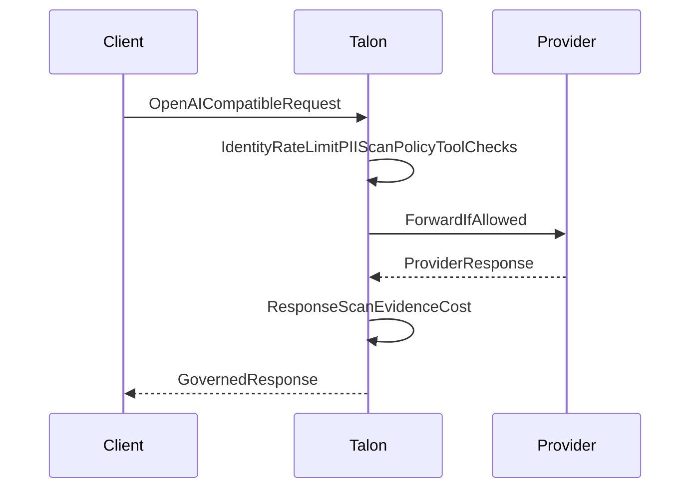

# Dativo Talon

**Evidence-grade AI governance gateway for European teams.**

[](https://github.com/dativo-io/talon/actions/workflows/ci.yml)
[](https://github.com/dativo-io/talon/actions/workflows/codeql.yml)
[](https://github.com/dativo-io/talon/releases/latest)
[](https://goreportcard.com/report/github.com/dativo-io/talon)
[](LICENSE)

[Docs](docs/README.md) ·
[Limitations](LIMITATIONS.md) ·
[Roadmap & focus](ROADMAP.md) ·
[Quickstart](docs/tutorials/proxy-quickstart.md) ·
[Docker demo](examples/docker-compose/README.md) ·
[Dashboard](docs/reference/gateway-dashboard.md) ·
[Limitations](LIMITATIONS.md) ·
[Releases](https://github.com/dativo-io/talon/releases/latest)

Talon is a single Go binary that sits in front of OpenAI, Anthropic, AWS Bedrock, Azure OpenAI, and any OpenAI-compatible client. Change one URL and every request is policy-checked, PII-scanned, cost-tracked, and written to a tamper-evident, HMAC-signed evidence record — same SDK, same response shape, governed path. Built for EU teams that need real governance signals for GDPR, NIS2, DORA, and the EU AI Act. Apache 2.0.

**Positioning:** Portkey helps you operate AI. AGT helps you build governed agents. **Talon helps you prove your AI traffic was governed — inside Europe, with signed evidence.** See [Roadmap & focus](ROADMAP.md) for what we deliberately do *not* build.

```
$ talon audit list
ID          TIME                 CALLER        PII              COST(€)  MODEL         DECISION
evt_a1b2c3  2026-03-15T10:23:45  support-bot   email(1)         0.003    gpt-4o-mini   allowed
evt_d4e5f6  2026-03-15T10:24:12  hr-assistant  iban(2)          0.000    gpt-4o        blocked:pii
evt_x9y0z1  2026-03-15T10:24:45  eng-tools     none             0.000    —             blocked:tool
evt_g7h8i9  2026-03-15T10:25:01  eng-tools     none             0.012    claude-3.5    allowed
evt_j0k1l2  2026-03-15T10:25:30  support-bot   email(1),phone   0.004    gpt-4o-mini   allowed:redacted
```

---

## Why Talon?

- **PII is scanned before the provider call** — email, IBAN, VAT, national IDs and more are detected up front, then redacted, blocked, or routed to EU-only models.
- **Policy is enforced before spend happens** — budgets and model allowlists are evaluated up front, not in a post-hoc alert after the money is gone.
- **Dangerous tools are filtered before the model can call them** — forbidden tools are stripped from the request before the LLM ever sees them.
- **Every decision becomes signed evidence** — each request produces an HMAC-SHA256 evidence record you can verify and export.
- **Built for EU compliance signals** — supporting controls mapped to GDPR, NIS2, DORA, and the EU AI Act.

---

## 60-second demo (no API key)

The bundled Docker Compose stack runs Talon plus a mock provider, so the full pipeline (policy, PII, cost, evidence) runs without any real LLM key.

```bash
git clone https://github.com/dativo-io/talon && cd talon
cd examples/docker-compose && docker compose up
```

In another terminal, send a request containing an email and an IBAN:

```bash
curl -X POST http://localhost:8080/v1/proxy/openai/v1/chat/completions \
  -H "Content-Type: application/json" \
  -d '{"model":"gpt-4o-mini","messages":[{"role":"user","content":"My email is jan@example.com and my IBAN is DE89370400440532013000. Help me reset my password."}]}'
```

You get a standard OpenAI-compatible JSON response from the mock provider — and Talon still ran every governance check. Inspect the evidence:

```bash
docker compose exec talon /usr/local/bin/talon audit list
docker compose exec talon /usr/local/bin/talon audit show <evidence-id>
```

The record shows the PII detected (email, IBAN), the data tier, the policy decision, the cost, and a verifiable HMAC signature. Full walk-through: [60-second demo](docs/tutorials/quickstart-demo.md).

---

## Drop-in OpenAI proxy

For an existing OpenAI SDK app, start the dev quickstart proxy and repoint the base URL:

```bash
talon serve --proxy-quickstart --port 8080
export OPENAI_BASE_URL=http://127.0.0.1:8080/v1
export OPENAI_API_KEY=sk-...
```

Use your normal OpenAI SDK — same request shape, same SDK, governed path:

```python
import openai

client = openai.OpenAI(
    base_url="http://127.0.0.1:8080/v1",
    api_key="sk-...",
)

resp = client.chat.completions.create(
    model="gpt-4o-mini",
    messages=[{"role": "user", "content": "Summarize EU AI Act obligations for SMBs."}],
)
print(resp.choices[0].message.content)
```

Governance (policy, PII scan/redaction, evidence) stays active in quickstart mode. For production, use `--gateway` with `talon.config.yaml`. See [OpenAI proxy quickstart](docs/tutorials/proxy-quickstart.md).

---

## What Talon does to every request

| # | Step | What happens |
|---|------|--------------|
| 1 | Identify caller | Look up caller from `Authorization: Bearer <key>`; load tenant, team, and policy overrides. |
| 2 | Rate limit | Token-bucket check (global + per-caller). |
| 3 | Extract model/text/tools | Provider-aware parse of the request body. |
| 4 | PII scan (input) | Regex recognizers find email, phone, IBAN, VAT, national IDs, and more. |
| 5 | Classify data tier | Highest-sensitivity finding sets the data tier. |
| 6 | OPA policy decision | Embedded OPA evaluates model allowlist, cost, tier, and provider rules. |
| 7 | Tool governance | Forbidden tools are filtered before forwarding. |
| 8 | Redact / block | In enforce mode, PII is redacted or the request is blocked. |
| 9 | Forward to provider | Request sent to the configured upstream (real key from the vault). |
| 10 | Response scan | LLM output scanned for PII (allow/warn/redact/block). |
| 11 | Evidence + cost | HMAC-signed evidence record written; cost attributed to the caller. |



Pipeline overhead is typically under 15ms excluding upstream latency. Reproduce on your machine: `make benchmarks`. Full byte-level breakdown: [What Talon does to your request](docs/explanation/what-talon-does-to-your-request.md) · [Benchmarks](docs/reference/benchmarks.md).

---

## Core features

### Evidence & compliance

- HMAC-SHA256 signed evidence record per request; verify with `talon audit verify`.
- Export to CSV, JSON, or signed JSON/NDJSON for auditors and offline verification.
- Supporting controls mapped to GDPR Article 30, NIS2, DORA, and EU AI Act traceability.
- Conformance: **317 passing tests** across the evidence + policy paths — reproduce with `make conformance`. See [Conformance suite & count](docs/reference/conformance.md).

See [Evidence store](docs/explanation/evidence-store.md).

### PII & data protection

- Input and output scanning with Presidio-compatible recognizers.
- EU identifiers: IBAN (MOD-97), VAT, national IDs across EU member states, plus email, phone, credit card, passport, IP.
- Redact, block, or warn modes; tier-based routing for sensitive data.

See [Policy cookbook: PII](docs/guides/policy-cookbook.md#redact-pii-in-requests).

### Cost governance / FinOps

- Per-caller daily and monthly budget caps, evaluated before the call.
- Per-request cost estimation from an operator-editable pricing table.
- Cost attribution by tenant, agent, and caller via `talon costs` and the dashboard.

See [Cap AI spend per caller](docs/guides/cost-governance-by-caller.md).

### Tool governance

- Allowed/forbidden tool lists, including glob patterns like `admin_*`.
- Forbidden tools are filtered out before the model sees them — prevention, not detection.
- Filtered tools are recorded in evidence for audit.

See [Tool governance](docs/guides/openclaw-integration.md).

### EU data sovereignty

- Provider registry with per-provider jurisdiction and EU region metadata.
- Routing modes: `eu_strict`, `eu_preferred`, and `global`, enforced by OPA.
- EU-capable providers: Azure OpenAI, AWS Bedrock (EU regions), Mistral, Vertex (EU regions), and local Ollama.

See [Provider registry](docs/reference/provider-registry.md).

### Dashboard & observability

- Embedded gateway dashboard with live request, PII, cost, and tool-governance metrics.
- Metrics API (`/api/v1/metrics`) plus an SSE stream for real-time updates.
- OpenTelemetry traces and metrics using GenAI semantic conventions.

See [Gateway dashboard](docs/reference/gateway-dashboard.md).

---

## Supported providers

Provider IDs and EU metadata come from the built-in registry. See [Provider registry](docs/reference/provider-registry.md) for the authoritative list.

| Provider | Gateway support | EU routing metadata | Notes |
|----------|-----------------|---------------------|-------|
| OpenAI (`openai`) | Yes | US jurisdiction | OpenAI API; custom base URL supported. |
| Azure OpenAI (`azure-openai`) | Yes | EU regions (westeurope, swedencentral, francecentral, uksouth) | EU-hosted OpenAI models. |
| Anthropic (`anthropic`) | Yes | US jurisdiction | Anthropic Messages API. |
| AWS Bedrock (`bedrock`) | Yes | EU regions (eu-central-1, eu-west-1, eu-west-3) | EU region locking. |
| Mistral (`mistral`) | Yes | EU jurisdiction | Mistral AI. |
| Ollama (`ollama`) | Yes | Local | Local models, no key needed. |
| Vertex (`vertex`) | Yes | EU regions (europe-west1/west4/west9) | Google Vertex AI. |
| Cohere (`cohere`) | Yes | CA jurisdiction | Cohere. |
| Generic OpenAI-compatible (`generic-openai`) | Yes | User-declared jurisdiction | Any OpenAI-compatible API. |

Inspect live with `talon provider list`, `talon provider info <type>`, and `talon provider allowed`.

---

## Integration paths

| Path | When | How |
|------|------|-----|
| Existing app | You already call OpenAI/Anthropic | Change the base URL and use a Talon caller key. See [Add Talon to your existing app](docs/guides/add-talon-to-existing-app.md). |
| Slack bot | A bot calls an LLM SDK | Route the OpenAI SDK through Talon. See [Slack bot integration](docs/guides/slack-bot-integration.md). |
| OpenClaw | You run OpenClaw | Point its provider base URL at the gateway. See [OpenClaw integration](docs/guides/openclaw-integration.md). |
| Coding agents | You run Claude Code or Codex CLI | `talon init --pack coding-agents`, point the tool's base URL at the gateway (conformance-suite verified: Anthropic Messages + OpenAI Responses wires incl. SSE). See [Claude Code](docs/guides/claude-code-integration.md), [Codex CLI](docs/guides/codex-cli-integration.md), and [Governing coding agents](docs/guides/governing-coding-agents.md). |
| MCP / vendor proxy | Third-party AI vendors | Route MCP traffic through Talon for tool governance and evidence. See [Vendor integration guide](docs/VENDOR_INTEGRATION_GUIDE.md). |
| Native Talon agent | Greenfield agent | Run governed agents directly with `talon run`. See [Your first governed agent](docs/tutorials/first-governed-agent.md). |

---

## Talon vs alternatives

Fair, factual positioning. Talon's differentiation is evidence-grade compliance and policy enforcement for EU teams.

| | Talon | Portkey | LiteLLM | Helicone | PII-only proxy |
|---|-------|---------|---------|----------|----------------|
| Primary focus | EU AI governance + signed evidence | AI gateway / routing | LLM proxy / routing | LLM observability | PII redaction |
| EU governance | Yes (sovereignty routing) | Partial | No | No | Partial |
| Signed evidence | Yes (HMAC) | No | No | No | No |
| Tool governance | Yes (pre-execution filter) | Partial | No | No | No |
| Cost controls | Yes (pre-spend caps) | Yes | Yes (alerts) | Yes (tracking) | No |

---

## Install

Talon requires **CGO** (SQLite). Go **1.22+** recommended (CI uses 1.25.x).

| Method | Platforms | Artifact / command |
|--------|-----------|------------------|
| **From source (recommended on macOS)** | linux, darwin (amd64, arm64) | `git clone … && make install` → `$(go env GOPATH)/bin/talon` |
| **`go install`** | linux, darwin (amd64, arm64) | `go install github.com/dativo-io/talon/cmd/talon@latest` |
| **Release tarball** | **linux/amd64 only** | `talon_<version>_linux_amd64.tar.gz` + `checksums.txt` on [Releases](https://github.com/dativo-io/talon/releases/latest) |
| **Install script** | linux/amd64 prebuilt; **darwin/arm64 falls back to `go install`** | `curl -sSL https://install.gettalon.dev \| sh` |
| **Docker / GHCR** | linux/amd64 images | `docker pull ghcr.io/dativo-io/talon:latest` (also `:vX.Y.Z`, `:X.Y`) |

On macOS, if `go install` fails with `unsupported tapi file type '!tapi-tbd'`, use system Clang:

```bash
CC=/usr/bin/clang CGO_ENABLED=1 go install github.com/dativo-io/talon/cmd/talon@latest
```

Or clone the repo and run `make install` (Makefile sets `CC=/usr/bin/clang` on Darwin).

### First run (`talon init` → `talon run`)

```bash
export TALON_SECRETS_KEY="$(openssl rand -hex 32)"   # vault encryption key
talon init --scaffold --name my-agent                # agent.talon.yaml + talon.config.yaml
talon run --dry-run "hello"                          # no LLM API key required
```

For a governed live call, set a provider key: `talon secrets set openai-api-key --value "$OPENAI_API_KEY"` (see [Your first governed agent](docs/tutorials/first-governed-agent.md)).

Verify release assets (linux/amd64):

```bash
gh release view --repo dativo-io/talon --json tagName,assets -q '.assets[].name'
# e.g. checksums.txt, talon_1.7.0_linux_amd64.tar.gz
```

---

## Configuration quick examples

Short snippets; see the [Policy cookbook](docs/guides/policy-cookbook.md) and [Configuration reference](docs/reference/configuration.md) for full schemas.

**Block on PII** (`agent.talon.yaml`):

```yaml
policies:
  data_classification:
    input_scan: true
    block_on_pii: true
```

**Cap daily spend** (`agent.talon.yaml`):

```yaml
policies:
  cost_limits:
    daily: 10.00
    monthly: 200.00
```

**Forbid dangerous tools** (gateway `talon.config.yaml`):

```yaml
gateway:
  default_policy:
    forbidden_tools: ["delete_*", "admin_*", "bulk_*"]
```

**EU strict routing** (`talon.config.yaml`):

```yaml
llm:
  routing:
    data_sovereignty_mode: eu_strict
```

---

## Proof Pack (trust & verification)

Artifacts a skeptical reviewer can grep in one session:

- [Limitations](LIMITATIONS.md) — what Talon does and does not prove
- [Threat model](docs/reference/threat-model.md) — attack surface and trust boundaries
- [Evidence integrity specification](docs/reference/evidence-integrity-spec.md) — byte-exact signing and verification
- [Conformance suite](docs/reference/conformance.md) — `make conformance` (evidence + policy paths)
- [Benchmarks](docs/reference/benchmarks.md) — `make benchmarks` on your hardware
- [Sample auditor pack](examples/auditor-pack/README.md) — signed export + compliance report + GDPR Art. 30 RoPA + EU AI Act Annex IV pack (`make auditor-pack`)
- [Roadmap & focus](ROADMAP.md) — public anti-goals and EMEA SMB direction

---

## Docs

- [Documentation index](docs/README.md)
- [60-second demo](docs/tutorials/quickstart-demo.md)
- [Your first governed agent](docs/tutorials/first-governed-agent.md)
- [Talon Security Boundaries & Limitations](LIMITATIONS.md)
- [What Talon does to your request](docs/explanation/what-talon-does-to-your-request.md)
- [Policy cookbook](docs/guides/policy-cookbook.md)
- [Provider registry](docs/reference/provider-registry.md)
- [Evidence store](docs/explanation/evidence-store.md)
- [Conformance suite & count](docs/reference/conformance.md)
- [Roadmap & focus](ROADMAP.md)
- [Gateway dashboard](docs/reference/gateway-dashboard.md)
- [OpenClaw integration](docs/guides/openclaw-integration.md)
- [Slack bot integration](docs/guides/slack-bot-integration.md)

---

## License

Apache 2.0 — see [LICENSE](LICENSE).
