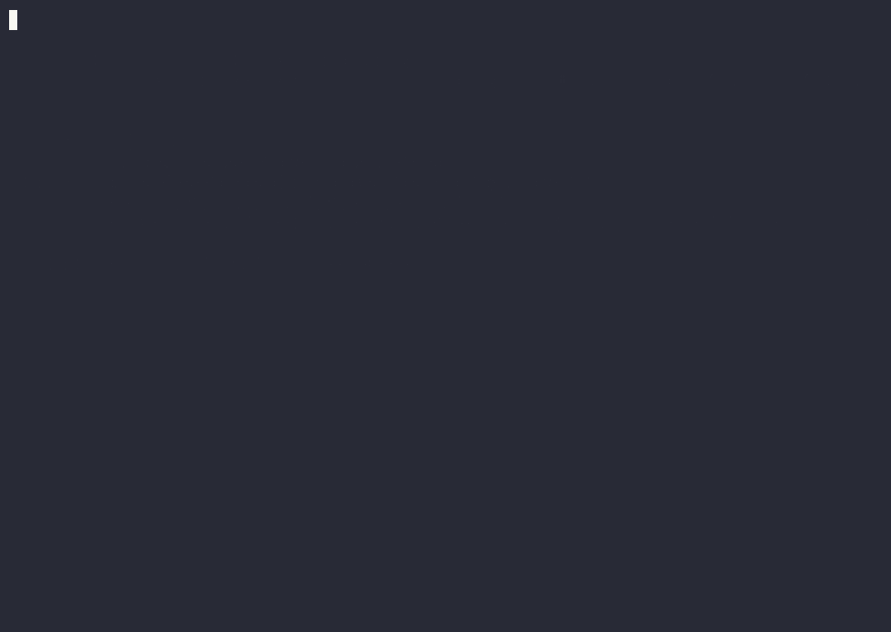
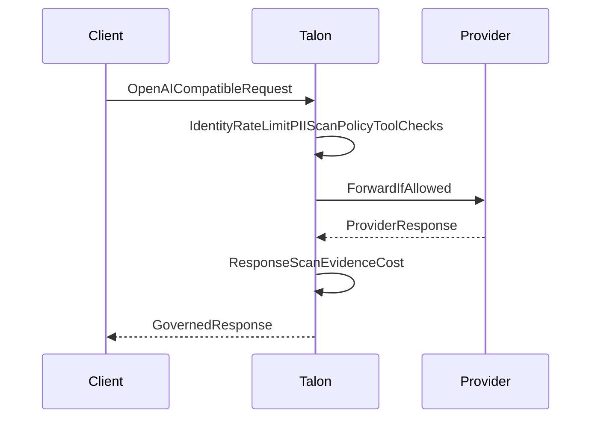

# Dativo Talon

**Evidence-grade AI governance gateway for European teams.**

[](https://github.com/dativo-io/talon/actions/workflows/ci.yml)
[](https://github.com/dativo-io/talon/actions/workflows/codeql.yml)
[](https://github.com/dativo-io/talon/releases/latest)
[](https://goreportcard.com/report/github.com/dativo-io/talon)
[](LICENSE)

Talon is a single Go binary that sits in front of OpenAI, Anthropic, AWS Bedrock, Azure OpenAI, and any OpenAI-compatible client. Change one URL and every request is policy-checked, PII-scanned, cost-tracked, and written to a tamper-evident, HMAC-signed evidence record — same SDK, same response shape, governed path. Built for EU teams that need real governance signals for GDPR, NIS2, DORA, and the EU AI Act. Apache 2.0.



*One AI session, one governed boundary: good traffic flows, a dangerous tool is stripped, PII is blocked before the provider, confidential data is refused by a US model and runs on a local one instead, runaway spend is stopped — and every decision verifies.*

**See it in 60 seconds, no API key →** [Try it now](#try-it-in-60-seconds-no-api-key) · **Deep proof on live providers →** [Governed session demo](#governed-session-demo-real-providers) · **Pilot on a real workload →** [Open a pilot issue](https://github.com/dativo-io/talon/issues/new?title=Pilot%3A%20%3Cyour%20stack%3E&body=Current%20stack%3A%0AFirst%20control%20I%20need%20%28PII%20%2F%20spend%20%2F%20tools%20%2F%20data%20residency%29%3A)

---

## Is this you?

Talon is for teams that **already have AI traffic in production** and need to answer:

- **What sensitive data are we sending, and where?** (PII, IBANs, national IDs — and which provider/region got them)
- **Which tools and models are actually allowed?** (not "should be" — enforced before the model runs)
- **How do we stop spend before it happens?** (a cap that denies the request, not an alert after the bill)
- **Can we prove the decision later?** (a signed record an auditor can verify offline)

If those are your questions, Talon sits in front of your existing OpenAI/Anthropic traffic and answers them at the boundary — no SDK change, same response shape.

---

## Start with one workload

You don't have to trust Talon in blocking mode on day one.

1. **Put Talon in front of one** dev or internal workload (change the base URL, add a caller key).
2. **Start in shadow mode** — Talon records what policy *would* do (PII, tools, spend, destinations) **without changing the response**.
3. **Turn on one control** when you're ready: block PII, cap spend, keep confidential data local, or strip a dangerous tool.

**Which are you?**

| I have… | Start here |
|---------|-----------|
| An existing OpenAI/Anthropic app | [Change the base URL](#drop-in-openai-proxy) |
| OpenClaw or a coding agent | [Use the integration pack](#integration-paths) |
| A new agent to build | `talon init` → `talon run` ([guide](docs/tutorials/first-governed-agent.md)) |

Or just [try it with no key](#try-it-in-60-seconds-no-api-key) first, then [open a pilot issue](https://github.com/dativo-io/talon/issues/new?title=Pilot%3A%20%3Cyour%20stack%3E&body=Current%20stack%3A%0AFirst%20control%20I%20need%20%28PII%20%2F%20spend%20%2F%20tools%20%2F%20data%20residency%29%3A) with your stack and the first control you need.

---

## Try it in 60 seconds (no API key)

The bundled Docker Compose stack runs Talon plus a mock provider, so the full pipeline (policy, PII, cost, evidence) runs without any real LLM key.

```bash
git clone https://github.com/dativo-io/talon && cd talon
cd examples/docker-compose && docker compose up
```

In another terminal, send a request containing an email and an IBAN:

```bash
curl -X POST http://localhost:8080/v1/proxy/openai/v1/chat/completions \
  -H "Content-Type: application/json" \
  -d '{"model":"gpt-4o-mini","messages":[{"role":"user","content":"My email is jan@example.com and my IBAN is DE89370400440532013000. Help me reset my password."}]}'
```

You get a standard OpenAI-compatible JSON response — and Talon still ran every governance check. Inspect the signed evidence:

```bash
docker compose exec talon /usr/local/bin/talon audit list
docker compose exec talon /usr/local/bin/talon audit show <evidence-id>
```

The record shows the PII detected (email, IBAN), the data tier, the policy decision, the cost, and a verifiable HMAC signature.

> **Why did the IBAN go through?** This demo ships in **shadow mode**: Talon *records* what policy would do — including the PII it found — **without changing the request**. That's the low-risk way to adopt: drop Talon in front of real traffic, see what it flags for a week, then flip to **enforce mode** to redact or block the IBAN before the provider (exactly what the hero above shows). One config line: `mode: shadow` → `mode: enforce`.

Full walk-through: [60-second demo](docs/tutorials/quickstart-demo.md).

---

## What Talon enforces (before the provider, then proves after)

Everything happens **on the request path, before it reaches the model** — and every decision is recorded:

- **PII is scanned before the provider call** — email, IBAN, VAT, national IDs and more are detected up front, then redacted, blocked, or routed to EU-only models.
- **Policy is enforced before spend happens** — budgets and model allowlists are evaluated up front, not in a post-hoc alert after the money is gone.
- **Dangerous tools are filtered before the model can call them** — forbidden tools are stripped from the request before the LLM ever sees them.
- **Confidential data can be kept in-region** — sovereignty routing rejects a US model for confidential data and runs the workload locally instead.
- **Every decision becomes signed evidence** — each request produces an HMAC-SHA256 record you can verify and export, mapped to GDPR, NIS2, DORA, and the EU AI Act.

---

## Drop-in OpenAI proxy

For an existing OpenAI SDK app, start the dev quickstart proxy and repoint the base URL — same request shape, same SDK, governed path:

```bash
talon serve --proxy-quickstart --port 8080
export OPENAI_BASE_URL=http://127.0.0.1:8080/v1
export OPENAI_API_KEY=sk-...
```

```python
import openai

client = openai.OpenAI(base_url="http://127.0.0.1:8080/v1", api_key="sk-...")
resp = client.chat.completions.create(
    model="gpt-4o-mini",
    messages=[{"role": "user", "content": "Summarize EU AI Act obligations for SMBs."}],
)
print(resp.choices[0].message.content)
```

Governance (policy, PII scan/redaction, evidence) stays active in quickstart mode. For production, use `--gateway` with `talon.config.yaml`. See [OpenAI proxy quickstart](docs/tutorials/proxy-quickstart.md).

---

## Governed session demo (real providers)

The deeper proof path runs one **real** agent session — an Anthropic planner and OpenAI executors — through the same gateway, bring-your-own keys (≈ $0.03/run, cheap models, session-capped):

```bash
export ANTHROPIC_API_KEY=sk-ant-... OPENAI_API_KEY=sk-...
make governed-session
cd examples/governed-session && ./demo.sh all
```


```
session begins ──▶ Anthropic orchestrates (prompt-cache write, then read); ChatGPT executes the plan
               ──▶ forbidden admin_* tool stripped · email redacted · model-allowlist deny
               ──▶ IBAN probe denied before any provider call
               ──▶ confidential data → US model rejected by policy → local Llama runs it (routed)
               ──▶ real cross-provider spend reaches the session cap → 403 session_budget_exceeded
               ──▶ money story from the signed export; flipping a signed field makes audit verify report INVALID
               ──▶ talon audit verify --session → N valid, 0 invalid; talon compliance ropa → GDPR Art. 30 pack
```

The sovereignty act shows **data classification driving execution placement**: confidential input is refused by the US model and runs locally instead — the same IBAN the gateway blocks outright elsewhere, because policy (not the data alone) decides the outcome. Every decision is a signed evidence record in one session trail: supporting controls and evidence for GDPR and EU AI Act reviews, not a compliance guarantee.

Recorded with [asciinema](https://asciinema.org) ([cast](docs/assets/talon_demo.cast) · [`scripts/record-governed-session.sh`](scripts/record-governed-session.sh)). Full walk-through: [governed-session demo](examples/governed-session/README.md). The sovereignty-routing act needs a local Ollama (opt-in `routing-demo` compose profile).

---

## What Talon does to every request

Each request flows through one governed pipeline before (and after) it reaches a provider:



Identify caller → rate limit → parse model/text/tools → **PII scan** → classify data tier → **OPA policy decision** (allowlist, cost, tier, provider) → **tool governance** → redact/block → forward with the vault key → response scan → **signed evidence + cost**. Pipeline overhead is typically under 15ms excluding upstream latency (`make benchmarks`).

Full byte-level breakdown: [What Talon does to your request](docs/explanation/what-talon-does-to-your-request.md) · [Benchmarks](docs/reference/benchmarks.md).

---

## Core features

| Area | What you get | Details |
|------|--------------|---------|
| **Evidence & compliance** | HMAC-SHA256 signed record per request; export to CSV/JSON/signed-JSON; controls mapped to GDPR Art. 30, NIS2, DORA, EU AI Act. | [Evidence store](docs/explanation/evidence-store.md) · [Conformance](docs/reference/conformance.md) |
| **PII & data protection** | Presidio-compatible input/output scanning; EU identifiers (IBAN MOD-97, VAT, national IDs) plus email, phone, card, passport, IP; redact/block/warn. | [Policy cookbook: PII](docs/guides/policy-cookbook.md#redact-pii-in-requests) |
| **Cost governance / FinOps** | Per-caller daily/monthly caps evaluated before the call; per-request estimation from an editable pricing table; attribution by tenant/agent/caller. | [Cap AI spend per caller](docs/guides/cost-governance-by-caller.md) |
| **Tool governance** | Allowed/forbidden lists with globs (`admin_*`); forbidden tools filtered before the model sees them; filtered tools recorded in evidence. | [Tool governance](docs/guides/openclaw-integration.md) |
| **EU data sovereignty** | Provider registry with jurisdiction + EU region metadata; `eu_strict` / `eu_preferred` / `global` routing enforced by OPA. | [Provider registry](docs/reference/provider-registry.md) |
| **Dashboard & observability** | Embedded gateway dashboard; metrics API + SSE stream; OpenTelemetry GenAI traces/metrics. | [Gateway dashboard](docs/reference/gateway-dashboard.md) |

**317 passing conformance tests** across the evidence + policy paths — reproduce with `make conformance`.

---

## Supported providers

EU-capable providers include **Azure OpenAI** (westeurope, swedencentral, francecentral, uksouth), **AWS Bedrock** (eu-central-1, eu-west-1, eu-west-3), **Mistral** (EU), **Vertex** (europe-west1/4/9), and **local Ollama**. US-jurisdiction providers (OpenAI, Anthropic, Cohere/CA) and any `generic-openai` endpoint are also supported, with jurisdiction metadata that routing policy can act on.

Full table with regions and notes: [Provider registry](docs/reference/provider-registry.md). Inspect live: `talon provider list`, `talon provider info <type>`, `talon provider allowed`.

---

## Integration paths

| Path | When | How |
|------|------|-----|
| Existing app | You already call OpenAI/Anthropic | Change the base URL and use a Talon caller key. See [Add Talon to your existing app](docs/guides/add-talon-to-existing-app.md). |
| Slack bot | A bot calls an LLM SDK | Route the OpenAI SDK through Talon. See [Slack bot integration](docs/guides/slack-bot-integration.md). |
| OpenClaw | You run OpenClaw | Point its provider base URL at the gateway. See [OpenClaw integration](docs/guides/openclaw-integration.md). |
| Coding agents | You run Claude Code or Codex CLI | `talon init --pack coding-agents`, point the tool's base URL at the gateway. See [Claude Code](docs/guides/claude-code-integration.md), [Codex CLI](docs/guides/codex-cli-integration.md), [Governing coding agents](docs/guides/governing-coding-agents.md). |
| MCP / vendor proxy | Third-party AI vendors | Route MCP traffic through Talon for tool governance and evidence. See [Vendor integration guide](docs/VENDOR_INTEGRATION_GUIDE.md). |
| Native Talon agent | Greenfield agent | Run governed agents directly with `talon run`. See [Your first governed agent](docs/tutorials/first-governed-agent.md). |

---

## Where Talon fits

Talon is **not another LLM observability dashboard or routing proxy.** Its focus is the **governed boundary**: enforce policy *before* the request reaches the model — PII, tools, spend, data residency — then emit signed evidence you can verify afterward. Routers optimize latency and cost; observability tools show you what already happened. Talon decides what is allowed to happen, and proves the decision.

Detailed comparison and why a PII-redaction proxy isn't enough: [Why not a PII proxy](docs/explanation/why-not-a-pii-proxy.md).

---

## Install

Talon requires **CGO** (SQLite). Go **1.22+** recommended (CI uses 1.25.x).

```bash
# From source (recommended on macOS)
git clone https://github.com/dativo-io/talon && cd talon && make install

# Or go install
go install github.com/dativo-io/talon/cmd/talon@latest

# Or Docker
docker pull ghcr.io/dativo-io/talon:latest
```

Release tarballs (linux/amd64) and an install script are on [Releases](https://github.com/dativo-io/talon/releases/latest). Platform matrix, checksums, and the macOS `!tapi-tbd` workaround: [Quickstart install guide](docs/QUICKSTART.md).

**First run:**

```bash
export TALON_SECRETS_KEY="$(openssl rand -hex 32)"   # vault encryption key
talon init --scaffold --name my-agent                # agent.talon.yaml + talon.config.yaml
talon run --dry-run "hello"                          # no LLM API key required
```

---

## Configuration

Short examples below; full schemas in the [Policy cookbook](docs/guides/policy-cookbook.md) and [Configuration reference](docs/reference/configuration.md).

```yaml
# agent.talon.yaml — block on PII, cap spend
policies:
  data_classification: { input_scan: true, block_on_pii: true }
  cost_limits: { daily: 10.00, monthly: 200.00 }
```

```yaml
# talon.config.yaml — forbid dangerous tools, enforce EU-strict routing
gateway:
  default_policy:
    forbidden_tools: ["delete_*", "admin_*", "bulk_*"]
llm:
  routing:
    data_sovereignty_mode: eu_strict
```

---

## Proof Pack (trust & verification)

Artifacts a skeptical reviewer can grep in one session:

- [Limitations](LIMITATIONS.md) — what Talon does and does not prove
- [Threat model](docs/reference/threat-model.md) — attack surface and trust boundaries
- [Evidence integrity specification](docs/reference/evidence-integrity-spec.md) — byte-exact signing and verification
- [Conformance suite](docs/reference/conformance.md) — `make conformance` (evidence + policy paths)
- [Benchmarks](docs/reference/benchmarks.md) — `make benchmarks` on your hardware
- [Sample auditor pack](examples/auditor-pack/README.md) — signed export + compliance report + GDPR Art. 30 RoPA + EU AI Act Annex IV pack (`make auditor-pack`)
- [Roadmap & focus](ROADMAP.md) — public anti-goals and EMEA SMB direction

---

## Docs

[Documentation index](docs/README.md) ·
[60-second demo](docs/tutorials/quickstart-demo.md) ·
[Your first governed agent](docs/tutorials/first-governed-agent.md) ·
[Limitations](LIMITATIONS.md) ·
[What Talon does to your request](docs/explanation/what-talon-does-to-your-request.md) ·
[Policy cookbook](docs/guides/policy-cookbook.md) ·
[Provider registry](docs/reference/provider-registry.md) ·
[Evidence store](docs/explanation/evidence-store.md) ·
[Conformance](docs/reference/conformance.md) ·
[Roadmap](ROADMAP.md) ·
[Gateway dashboard](docs/reference/gateway-dashboard.md)

---

## Pilot Talon on a real workload

The fastest way to know if Talon fits: put **one** workload behind it in shadow mode and see what it flags. Common first steps:

| Workload | First control |
|----------|--------------|
| OpenAI support bot | Block customer PII before the provider |
| OpenClaw / coding agent | Control which tools and models are allowed; signed execution evidence |
| Regulated app | Keep confidential data on a local/EU model |
| Any app with a growing bill | Cap spend before the request, not after |

**[Open a pilot issue →](https://github.com/dativo-io/talon/issues/new?title=Pilot%3A%20%3Cyour%20stack%3E&body=Current%20stack%3A%0AFirst%20control%20I%20need%20%28PII%20%2F%20spend%20%2F%20tools%20%2F%20data%20residency%29%3A)** with your current stack and the one control you need first — we'll help you get it running.

---

## License

Apache 2.0 — see [LICENSE](LICENSE).
