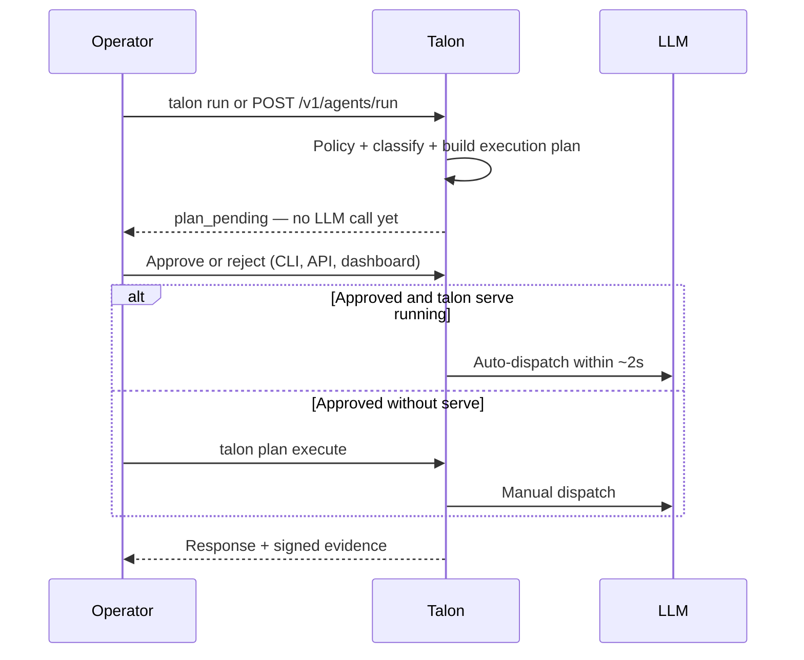

# How to test and operate Plan Review

Plan review is an **optional human-oversight gate** for native `talon run` agents — most Talon deployments (gateway proxying, coding agents) never enable it, and none of the four operating pillars depend on it. This operator guide covers Talon's **Plan Review Gate**: when enabled, it pauses agent execution **before the first LLM call** until an operator approves the execution plan, with every decision recorded in signed evidence. It provides supporting controls for EU AI Act Art. 14-style human oversight — not a compliance claim.

**Not covered here:** per-tool approval during the agentic loop (`/v1/tool-approvals`). That is a separate mid-run gate. See [Operational control plane](../reference/operational-control-plane.md).

---

## Lifecycle



| Plan status | Meaning |
|-------------|---------|
| `pending` | Awaiting human decision |
| `approved` | Decision recorded; not yet executed |
| `rejected` | Blocked for this plan |
| dispatched | Execution completed (or dispatch failed) |

---

## Prerequisites

```bash
export TALON_SECRETS_KEY="$(openssl rand -hex 32)"
export OPENAI_API_KEY="sk-..."                        # or: talon secrets set openai-api-key ...
export TALON_ADMIN_KEY="strong-admin-key"             # API/dashboard approvals

mkdir my-workspace && cd my-workspace
talon init --scaffold --name my-agent
talon secrets set openai-api-key "$OPENAI_API_KEY"
```

---

## Policy configuration

In `agent.talon.yaml` under `compliance`:

### Force review on every run (best for first E2E test)

```yaml
compliance:
  human_oversight: "always"
```

### Selective review (production)

```yaml
compliance:
  human_oversight: "on-demand"
  plan_review:
    require_for_tools: true
    cost_threshold: 0.10
    require_for_tier: "tier_2"
    volume_threshold: 50
```

| `human_oversight` | Behavior |
|-------------------|----------|
| `"always"` | Every run gated |
| `"on-demand"` | Gated only when a `plan_review` rule fires |
| `"none"` / omitted | No plan gate |

### When does `on-demand` fire?

Evaluated in the Plan Review Gate **before** the LLM call:

| Rule | Fires when |
|------|------------|
| `require_for_tools: true` | Runtime **tool registry** has ≥1 registered tool |
| `cost_threshold` | Pre-run cost estimate (EUR) ≥ threshold |
| `require_for_tier: "tier_2"` | Classified input tier ≥ 2 (e.g. PII in prompt) |
| `volume_threshold` | Destructive verb + number > threshold in plan text (intent/tool path; see limitation below) |

### `allowed_tools` is not `require_for_tools`

```yaml
capabilities:
  allowed_tools: [sql_query, file_read]   # policy allowlist only
```

The gate checks `len(toolRegistry.List()) > 0`, not `allowed_tools`. On `talon run`, the registry starts **empty** unless tools are registered at runtime. Listing tools in policy alone does not trigger `require_for_tools`.

### `talon intent classify` is not `talon run`

```bash
talon intent classify summarize '{"prompt":"..."}'
# Plan review: true
```

`intent classify` answers: *if this **tool** were invoked, would review be required?* It simulates `hasTools: true`.

`talon run "..."` answers: *should **this run** gate before any LLM call?* It uses the real registry, input tier, and pre-run cost estimate.

**Known limitation:** `volume_threshold` on user prompts may not fire on `talon run` today because the gate does not pass prompt text into `RequiresReview`. Volume rules apply reliably via `talon intent classify` and tool-intent paths.

---

## Path A — CLI only (no `talon serve`)

```bash
# 1. Trigger — expect plan id, NO LLM answer
talon run "Summarize EU AI Act milestones for compliance teams"
# ✓ Plan pending human review: plan_<id>

# 2. List pending
talon plan pending --tenant default

# 3. Approve
talon plan approve plan_<id> --tenant default --reviewed-by <your-name>

# 4. Execute (required when serve is not running)
talon plan execute plan_<id> --tenant default
# ✓ Evidence stored: req_<id>

# 5. Reject (optional)
talon plan reject plan_<id> --tenant default \
  --reviewed-by <your-name> --reason "Scope too broad"
```

**Approve alone does not run the agent** when `talon serve` is not running.

---

## Path B — `talon serve` + auto-dispatch

```bash
# Terminal 1
export TALON_ADMIN_KEY="..."
talon serve --port 8080

# Terminal 2 — trigger
talon run "Summarize EU AI Act milestones for compliance teams"

# Approve (CLI or API — both update the same plan store)
talon plan approve plan_<id> --tenant default --reviewed-by <your-name>
```

Or via API:

```bash
curl -X POST "http://localhost:8080/v1/plans/plan_<id>/approve" \
  -H "X-Talon-Admin-Key: $TALON_ADMIN_KEY" \
  -H "Content-Type: application/json" \
  -d '{"reviewed_by":"<your-name>"}'
```

The auto-dispatcher polls every ~2s. No `talon plan execute` needed when serve is running.

Verify dispatch:

```bash
curl -s -H "X-Talon-Admin-Key: $TALON_ADMIN_KEY" \
  'http://localhost:8080/v1/evidence?limit=5&invocation_type=plan_dispatch' | jq .
```

---

## Path C — Dashboard

```
http://localhost:8080/dashboard?talon_admin_key=$TALON_ADMIN_KEY
```

1. Trigger a gated run (`talon run` or API).
2. Open **Plans Awaiting Review**.
3. Approve or reject (reject prompts for a reason).
4. With `talon serve` running, execution starts automatically after approve.

---

## HTTP API

| Action | Method | Auth |
|--------|--------|------|
| Trigger run | `POST /v1/agents/run` | Agent key (native-only serve); admin key when a gateway is served |
| List pending | `GET /v1/plans/pending` | Agent key or admin key |
| Get plan | `GET /v1/plans/{id}` | Agent key or admin key |
| Approve | `POST /v1/plans/{id}/approve` | Admin key only |
| Reject | `POST /v1/plans/{id}/reject` | Admin key only |
| Modify | `POST /v1/plans/{id}/modify` | Admin key only |

Admin header: `X-Talon-Admin-Key: <key>` (Bearer fallback accepted). Full matrix: [Authentication and key scopes](../reference/authentication-and-key-scopes.md).

Trigger example:

```bash
curl -s -X POST http://localhost:8080/v1/agents/run \
  -H "Authorization: Bearer <agent-key-value>" \
  -H "Content-Type: application/json" \
  -d '{"tenant_id":"default","agent_name":"my-agent","prompt":"Your query"}' | jq .
```

With `human_oversight: "always"`, the response includes `plan_pending` and `session_id` (HTTP 200 or 202).

---

## Validated test matrix

Run **one block at a time**. Do not paste markdown headings or comment lines into the shell.

Edit YAML without `yq` (works on minimal Ubuntu):

```bash
# Switch to on-demand
sed -i 's/human_oversight:.*/human_oversight: "on-demand"/' agent.talon.yaml
grep human_oversight agent.talon.yaml

# Switch to always
sed -i 's/human_oversight:.*/human_oversight: "always"/' agent.talon.yaml
```

| Test | Config | Command | Expected |
|------|--------|---------|----------|
| Low risk passes | `on-demand` | `talon run "Summarize EU AI Act milestones"` | Full LLM answer, no `plan_pending` |
| PII gates | `on-demand` + `require_for_tier: tier_2` | `talon run "Customer: jan.kowalski@example.com IBAN DE89370400440532013000"` | `plan_pending`, no LLM body |
| Always gates | `always` | `talon run "test"` | `plan_pending` |
| Intent preview | any | `talon intent classify delete_records '{"count": 10000}'` | `Plan review: true` (informational only) |

Use real plan IDs from `talon plan pending` — never paste the literal placeholder `plan_<id>`.

---

## Evidence

| `invocation_type` | When |
|-------------------|------|
| `plan_review` | Approve/reject decision |
| `plan_dispatch` | Approved plan executed (serve auto or `plan execute`) |
| (default) | Final LLM response |

Approval is audited even if execution never happens.

---

## E2E checklist

- [ ] `talon run` prints `Plan pending human review: plan_<id>` with **no LLM body**
- [ ] `talon plan pending` lists the plan
- [ ] `talon plan approve` succeeds; plan leaves pending list
- [ ] **Without serve:** `talon plan execute` returns LLM output + evidence
- [ ] **With serve:** `plan_dispatch` evidence within ~2s of approve
- [ ] Reject: plan never executes; reason in evidence
- [ ] Agent key cannot `POST .../approve` (401/403)

Smoke parity: [tests/smoke_sections/24_plan_dispatch.sh](../../tests/smoke_sections/24_plan_dispatch.sh).

Structured testcase inventory and phased E2E script: [Plan Review E2E test case](plan-review-e2e-testcase.md).

---

## Troubleshooting

| Symptom | Cause | Fix |
|---------|-------|-----|
| Run completes immediately | `on-demand` and no rule fired | Use `human_oversight: "always"` for testing |
| `intent classify` true but run not gated | Tool simulator vs run gate | See sections above |
| Approved but no LLM output | Serve not running; no `plan execute` | Run `talon plan execute <id>` |
| PII plan fails at execute | Tier 2 → Bedrock not configured | Adjust `tier_2` routing or configure Bedrock |
| `/v1/evidence` 401 | No keyed agent on minimal serve | Use admin key |
| `plan_<id>: No such file` | Pasted placeholder literally | Use IDs from `talon plan pending` |
| Both runs gated after "on-demand" test | `human_oversight` still `always` | `grep human_oversight agent.talon.yaml` |

---

## Related docs

- [Agent planning](../AGENT_PLANNING.md) — execution model, loop limits
- [Policy cookbook](policy-cookbook.md) — `plan_review` YAML snippets
- [Authentication and key scopes](../reference/authentication-and-key-scopes.md)
- [Operational control plane](../reference/operational-control-plane.md) — tool approvals, runs, overrides
- [examples/plan-review/README.md](../../examples/plan-review/README.md) — minimal demo script
