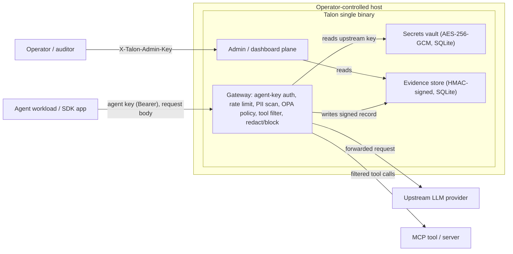

# Threat Model

**Status:** stable · **Scope:** the Talon gateway/proxy request path and its evidence,
secrets, and policy components.

This document lets a security reviewer map Talon's attack surface, trust boundaries, and
key-management assumptions without contacting the maintainers. It uses a STRIDE-style
framing. For the boundaries of what Talon claims, see [LIMITATIONS.md](../../LIMITATIONS.md);
for the signed-record format, see the
[Evidence integrity specification](evidence-integrity-spec.md).

> **One-line summary.** Talon is a self-hosted network gateway that enforces policy and
> emits signed evidence on the request path. It reduces and records risk on that path; it
> does not harden the host, secure upstream providers, or make the operator's compliance
> determination.

## 1. System overview and data flow

Trust-boundary crossings (each is a point where data changes trust domain):

1. **Workload → Gateway** — every request is untrusted until its agent key resolves to a registered agent.
2. **Gateway → Upstream provider** — a separate trust domain, possibly outside the EU.
3. **Gateway → MCP tool/server** — tool execution happens outside Talon.
4. **Operator → Host/Process** — everything inside the host is operator-controlled.
5. **Admin/auditor → Admin plane** — privileged read/management access.
6. **At rest** — the SQLite vault and evidence database files on the host disk.

## 2. Assets

| Asset | Why it matters | Primary protection |
|-------|----------------|--------------------|
| Upstream provider API keys | Spend and data-egress authority | AES-256-GCM vault, per-agent/tenant ACL, audited access ([`internal/secrets/vault.go`](../../internal/secrets/vault.go)) |
| Evidence records | The audit/compliance value proposition | HMAC-SHA256 signature ([`internal/evidence/signature.go`](../../internal/evidence/signature.go)) |
| PII in request/response | GDPR exposure | Pre-call input scan + output scan, redact/block ([`internal/classifier/pii.go`](../../internal/classifier/pii.go)) |
| Policy configuration | Defines allow/deny, budgets, routing | Operator-controlled config; embedded OPA ([`internal/policy/engine.go`](../../internal/policy/engine.go)) |
| Signing & encryption keys | Root of evidence integrity and vault confidentiality | Operator-managed secrets (see [§5](#5-key-management)) |

## 3. Trust boundaries and controls

### 3.1 Agent workload ↔ Gateway

- Every request authenticates with an **agent key** (`Authorization: Bearer <key>` or
  `x-api-key`), a vault-bound secret referenced by `agent.key.secret_name` in the
  agent's `agent.talon.yaml`. Comparison against the identity registry is constant-time
  (`crypto/subtle.ConstantTimeCompare`) to resist timing attacks.
- A presented key resolves to exactly one agent or the request is rejected (401) —
  there is no source-IP identity and no anonymous fallback; the only keyless path is
  the explicit in-process synthetic identity of `--proxy-quickstart`.
- The resolved agent selects the tenant (`key → agent → tenant_id`, the only tenant
  derivation), team, and the agent's one policy override; rate limits apply per agent
  (token bucket).
- Request bodies are **untrusted input**: parsed defensively, scanned for PII, and (for
  attachments) sandboxed and scanned for prompt-injection patterns.

### 3.2 Gateway ↔ Upstream provider

- The upstream provider is a distinct trust domain. Talon forwards the request using the
  real key resolved from the vault; the agent workload never needs the upstream key —
  it holds only its own Talon agent key.
- Sovereignty/routing policy can **deny** a non-EU destination with signed evidence; in
  the proxy path this is allow/deny, not a silent reroute (see [LIMITATIONS.md](../../LIMITATIONS.md)).
- A compromised or misbehaving provider is **out of scope** — Talon cannot vouch for what
  happens after the request leaves it.

### 3.3 Gateway ↔ MCP tool / server

- Tool governance today is **request-body filtering**: forbidden tools are stripped before
  forwarding ([`internal/gateway/tool_filter.go`](../../internal/gateway/tool_filter.go)).
- Talon does **not** intercept tool *execution* in another runtime, and does not prevent a
  tool from being invoked on a path that does not pass through Talon.

### 3.4 Operator ↔ Host / Process

- Talon is a single binary applying process-level controls. It is **not** an OS/kernel
  sandbox. Host compromise, container escape, and lateral movement are out of scope and
  remain the operator's responsibility.

### 3.5 At-rest stores and admin plane

- Secrets are encrypted at rest (AES-256-GCM); evidence is signed (HMAC-SHA256). The
  SQLite files themselves rely on host filesystem permissions.
- Admin/control-plane and dashboard/metrics endpoints are gated by `TALON_ADMIN_KEY`
  (`X-Talon-Admin-Key`). If unset, those endpoints are unrestricted — set it in production.

## 4. STRIDE threats and mitigations

| Threat | Example | Mitigation | Residual risk / out of scope |
|--------|---------|------------|------------------------------|
| **Spoofing** | Workload impersonates another agent or tenant | Agent-key auth (vault-bound, constant-time compare); key → agent → tenant derivation; unknown keys always rejected | Stolen agent key (see [§5](#5-key-management)) |
| **Tampering** | Edit a stored evidence row | HMAC-SHA256 over canonical JSON; `talon audit verify` fails on any change | Attacker with the signing key can forge new records |
| **Repudiation** | "That request never happened" | Evidence-by-default: every decision (incl. denials/failures) is recorded and signed | Records created only for traffic that passes through Talon |
| **Information disclosure** | PII leaks to provider or logs | Pre-call PII scan + redact/block; output scan; vault encryption; PII redaction in evidence | Regex/heuristic PII detection has imperfect recall |
| **Denial of service** | A workload floods the gateway | Per-agent + global token-bucket rate limiting; context timeouts | Host/network-level DoS is out of scope |
| **Elevation of privilege** | Unauthorized secret/admin access | Per-agent/tenant secret ACLs with audit logging; `TALON_ADMIN_KEY` on admin plane | Host compromise or leaked admin key |

## 5. Key management

Talon uses three operator-managed secrets (see
[Configuration reference](configuration.md)):

| Key | Purpose | Format | Default |
|-----|---------|--------|---------|
| `TALON_SIGNING_KEY` | HMAC-SHA256 evidence signing | >= 32 raw bytes or 64+ hex chars | Auto-derived per machine |
| `TALON_SECRETS_KEY` | AES-256-GCM vault encryption | 32 raw bytes or 64 hex chars | Auto-derived per machine |
| `TALON_ADMIN_KEY` | Admin/control-plane + dashboard auth | operator-chosen string | unset (endpoints unrestricted) |

In addition to these three, each agent has an **agent traffic key**: a vault-bound
secret (referenced by `agent.key.secret_name`, encrypted under `TALON_SECRETS_KEY`)
that authenticates that one agent's gateway traffic and tenant-scoped API access.

- **Blast radius of a stolen agent key** is bounded to that one agent: the attacker
  inherits exactly the agent's effective policy (its cost caps, model list, tool and
  egress rules) and its derived tenant scope — never another tenant's data and never
  admin authority. Every request made with it is still enforced and evidenced.
- **Rotation** is `talon secrets set <secret_name> <new-value>` plus a `talon serve`
  restart (periodic reload is #269). One agent has one active key; there is never a
  window with two concurrently-valid keys, and raw key values cannot appear in policy
  files (the schema accepts only a vault secret name).

Assumptions and guidance:

- **Location.** Keys are read from the environment/configuration of the Talon process.
  They are never sent to workloads or providers, and the signing key never leaves the
  host.
- **Set them explicitly in production.** By default the signing and secrets keys are
  derived per machine; explicit, backed-up keys are required for reproducible verification
  across machines and for disaster recovery. The signing and secrets keys must differ.
- **Rotation.** Rotating `TALON_SIGNING_KEY` means new records are signed with the new
  key; records signed with a previous key verify only under that previous key. Retain
  prior signing keys (or re-export) to keep historical evidence verifiable. Rotating
  `TALON_SECRETS_KEY` requires re-encrypting stored secrets.
- **Blast radius.** A leaked signing key lets an attacker forge or alter records that
  still verify — evidence integrity depends entirely on its secrecy. A leaked secrets key
  exposes the vaulted provider credentials. A leaked admin key exposes the control plane.

## 6. What the HMAC signature does and does not prove

A valid signature proves that an evidence record was signed with the deployment's
configured key and — assuming that key remains protected — has not been modified since
signing. It does **not** prove that the policy decision, model response, tool result, or
operator configuration was correct, and it does not attest anything about upstream or
downstream systems. HMAC is symmetric: anyone holding the key can produce valid
signatures, so this is integrity under the operator's key custody, not third-party
non-repudiation.

## 7. Residual risks (operator responsibilities)

- Host and OS hardening, network security, and container isolation.
- Custody, rotation, and backup of signing/encryption/admin keys.
- Filesystem access control on the SQLite vault and evidence databases.
- Trust decisions about upstream providers and external tools.
- The legal/compliance determination itself (Talon supplies supporting controls and
  evidence only).

## 8. Reporting

Report suspected vulnerabilities privately per [SECURITY.md](../../SECURITY.md). Do not
open a public issue for security reports.
